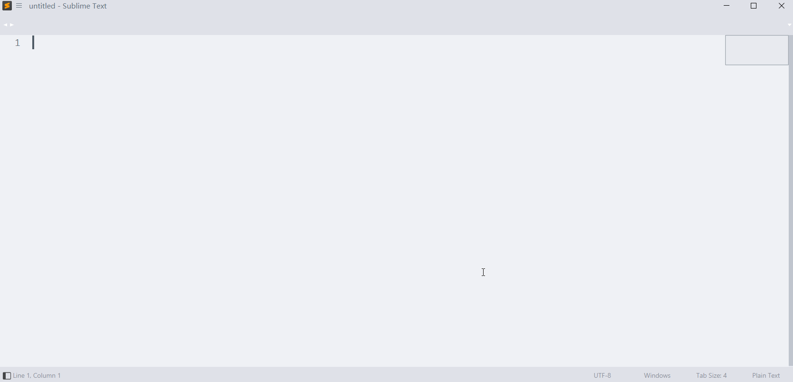

[SSH-Panel](https://github.com/ta946/SSH-Panel) (Windows)
=========

## Forked from [SSH-Panel](https://github.com/Haiquan-27/SSH-Panel) ([original README](README_original.md))

This Sublime Text plugin allow you to browse and edit files on remote servers

Windows and Linux servers that support any openssh available



# Installation

* Manual installation
> Download this package as ZIP file and extract to **"{you packages path}/SSH-Panel"**


# Settings

Setup service connect parameter

open command palette and select `SSH-Panel: Edit Settings` command to edit settings file

## parameter description:

### root:
* `default_connect_settings` All connect use default parameter values
* `server_settings` Specify preferences for connections
* `debug_mode` Debug enable switch
* `style_css` Custom CSS Style,value is sublime resource,default is *Packages/SSH-Panel/style.css* [see details](#style-coustom)
* `new_window` open new window when connect
* `quiet_log` the pop-up message panel is not displayed immediately when a message is obtained
* `reconnect_on_start` whether to automatically open the last closed connection when starting sublime text
* `nav_bar_color_change` change color of the directory panel,value range is -16777215~+16777215(-0xffffff~+0xffffff) type is string,this value will be added with the RGB color of the current view background to get a new RGB color
> if you not want to change the background color value can be set to "0"
### path:
* `remote_path` The path on the remote host. You can use the environment variable of the remote host ,like "$HOME" or "%userprofile%",value is path name or path list
> Each remote root path will be mapped to the subdirectory of `local_path`. The subdirectory name is the summary string generated by the path name
* `local_path` Local directory for synchronization,if empty will automatically generated in the user's home directory.can use the local environment variable
```
string "{auto_generate}" will be replaced with the UUID string generated from configuration and timestamp to generate a unique UUID path
After the first connection, this path will be save to the user configuration and using at next connection
```
### connect and authentication:
* `network_timeout` The number of timeout seconds used to authenticate and connect to the remote host
* `port` SSH service port of remote host,default is 22
* `known_hosts_file` know_hosts file path at local,if filled it will:
> use the host key algorithm recorded in known_hosts_file when connecting
> if host not recorded in known_hosts_file, confirm whether to add and save the host public_key when connecting
> warn and force close connect when public_key obtained from remote host not matches public_key recorded in known_host_file
* `username` user name on remote host
* `hostname` remote host IP address or domain name
* `always_fingerprint_confirm` confirm server fingerprint every time,if `known_hosts_file` is set wile use AA to verify the host fingerprint
#### if your server uses password authentication,option is:
* `password` password plaintext
* `save_password` save password plaintext in settings file,if is false the password will be deleted in the settings after connecting
#### if your server uses private and public_key authentication,option is:
* `private_key` used to set the encryption method and private key path when logged in to the server with the key
```
 key algorithm available "RSAKey","DSSKey","ECDSAKey","Ed25519Key"
 The value is a list of 2 elements like [{RSAKey/DSSKey/ECDSAKey/Ed25519Key},{private key path}]
 !! if you sublime version < 4000 the command to generate the key must contain the [-m PEM] parameter or use a tool to convert the existing private key file format
```
* `"need_passphrase"` tells the plug-in whether a passphrase is set when generating a key pair, value is bool
#### if your server uses gssapi authentication,option is:
* `gss_host` remote host IP address or domain name,if used, the `hostname` option is not used
* `gss_auth` enable gss authentication ,valus is bool
* `gss_kex` enable gss kex,valus is bool
* `gss_deleg_creds` gss deleg creds
* `gss_trust_dns` gss trust dns

## Example
```js
"server_settings":{
		// use password and username connect
		"MyServer0":{
			"username":"",
			"hostname":"", // ip or domain name
			"password":"", // if empty will prompt intput when connect
			"save_password":false, // (optional) default is true
			// ...
		},
		// use username and [private key] connect
		"MyServer1":{
			"username":"",
			"hostname":"",
			"private_key":["RSAKey","~/.ssh/id_rsa"],			// ssh-keygen -t rsa [-m PEM]
			// "private_key":["DSSKey","~/.ssh/id_dsa"]			// ssh-keygen -t dsa [-m PEM]
			// "private_key":["ECDSAKey","~/.ssh/id_ecdsa"]		// ssh-keygen -t ecdsa [-m PEM]
			// "private_key":["Ed25519Key","~/.ssh/id_ed25519"] // ssh-keygen -t ed25519 [-m PEM]
			"need_passphrase":false								// (optional) default is false, if is true will prompt intput when connect
			// path
			"remote_path":"/", // absolute path
			// "remote_path":["/var","/etc"], // path list
			// "remote_path":"%HOME/", // using environment variables (remote host)
			"local_path":"~/SFTP-Local/{auto_generate}" // auto generate
			// ...
		},
		// use gssapi connect
		"MyServer2":{
			"username":"",
			"gss_host":"",
			"gss_auth":true,
			"gss_kex":true,
			"gss_deleg_creds":true,
			"gss_trust_dns":true
			// ...
		},
		// ...
	},
```

# Using
open command palette and select `SSH-Panel: Connect Server` command

after select you server name to connect

you can edit and view server information on the pop-up directory panel

## quick button:
* `[?]` :help
* `[I]` :show server infomation
* `[R]` :refresh and sync file list
* `[E]` :edit settings
* `[T]` :pseudo terminal
* `[+]` :add new root path
* `[-]` :remove root path from view
you can click the `[...]` button on the right side of the directory or file to view attribute, delete or create a new one

# Style coustom

you can set *style_css* option to control display in HTML style of output_panel and navigation_view

Create file *"Packages\User\SSH-Panel\style.css"* in sublime package path and set *"style_css":"Packages\User\SSH-Panel\style.css"*

## css class
```css
<!-- the following class will be load -->
<!-- The available syntax rules follow https://www.sublimetext.com/docs/minihtml.html -->
.keyword{}
.keyword_error{}
.symbol{}
.title_bar{}
.res_dir{}
.res{}
.res_focus{}
.operation_menu{}
.warning{}
.error{}
.info{}
.debug{}
.no_accessible{}
```

<br />
<br />
<hr/>
<br />
<br />

# For the best sublime ssh setup
* install [SublimeRepl-ssh](https://github.com/ta946/SublimeREPL-ssh)
* add the following file into {you packages path}:
<details><summary>ssh_run.py</summary>
```
import sublime
import sublime_plugin


USER = '' # ENTER THE DEFAULT USER NAME
KEY = '' # ENTER THE PATH TO YOUR DEFAULT SSH KEY .pem File
SSHPANEL_OUTPUT_PANEL_NAME = "ssh-panel"
SSHPANEL_SETTING_FILE_NAME = 'ssh-panel.sublime-settings'


class ssh_runCommand(sublime_plugin.WindowCommand):
    def run(self, ip, user=None, key=None):
        if user is None: user = USER
        if key is None: key = KEY
        cmd = ["ssh", "-tt", "-i", key, f"{user}@{ip}"]
        sublime.active_window().run_command("repl_open", {
            "cmd": {"windows": cmd},
            "type": "ssh",
            "cmd_postfix": "\n",
            "encoding": {"linux": "utf-8", "osx": "utf-8", "windows": "$win_cmd_encoding"},
            "env": {},
            "external_id": "shell",
            "suppress_echo": True,
            "syntax": "Packages/SublimeREPL-ssh/config/Io/Io.tmLanguage"
        })


class SshPanelSettings:
    def __init__(self, setting_file_name=SSHPANEL_SETTING_FILE_NAME):
        self._setting_file_name = setting_file_name
        self.settings = None

    def get_settings(self):
        self.settings = sublime.load_settings(self._setting_file_name)
        return self.settings

    def save_settings(self, settings):
        sublime.save_settings(self._setting_file_name)

    def check_server_in_settings(self, name, settings=None):
        if settings is None:
            settings = self.settings or self.get_settings()
        server_settings = settings['server_settings']
        if name in server_settings:
            return True, settings
        return False, settings

    def ensure_server_in_settings(self, ip, name, user, key):
        ret, settings = self.check_server_in_settings(name)
        if ret:
            return
        settings['server_settings'][name] = {
            "hostname": ip,
            "username": user,
            "private_key": key,
            "remote_path": ["."],
            "local_path": "~/SFTP-Local/{auto_generate}",
            "need_passphrase": False,
            "aws_id": None
        }
        self.save_settings(settings)

    def update_server_ip(self, name, ip, settings=None):
        if settings is None:
            settings = self.settings or self.get_settings()
        server_settings = settings['server_settings']
        server_settings[name]['hostname'] = ip
        settings['server_settings'] = server_settings
        return settings


class ssh_sftp_runCommand(sublime_plugin.WindowCommand):
    def run(self, name=None, repl_only=False):
        self.name = name
        self.repl_only = bool(repl_only)
        self.settings_handler = SshPanelSettings()
        self.settings = self.settings_handler.get_settings()

        server_names = list(self.settings['server_settings'])

        if name is not None and name in self.settings['server_settings']:
            return self.on_done(name)

        self.window.show_quick_panel(server_names, lambda idx: self.on_select(idx))

    def on_change(self, *args, **kwargs):
        pass

    def on_cancel(self, *args, **kwargs):
        print('no server selected')

    def on_select(self, idx):
        if idx == -1: return self.on_cancel()
        # elif _id == len(self.items)-1:
        #     self.window.show_input_panel('_id', '', self.on_done, self.on_change, self.on_cancel)
        else:
            name = list(self.settings['server_settings'])[idx]
            self.on_done(name)

    def on_done(self, name):
        print('ssh sftp', name)
        server_dict = self.settings['server_settings'][name]
        print('server_dict')
        print(server_dict)
        ip = server_dict['hostname']
        user = server_dict['username']
        key = server_dict['private_key']
        self._run(ip, name, user, key)

    def _run_ssh_panel(self, name):
        self.window.run_command(
            cmd="ssh_panel_create_connect",
            args={
                "server_name": name,
                "connect_now": True,
                "reload_from_view": False
            }
        )

    def _run(self, ip, name, user, key):
        self.settings_handler.ensure_server_in_settings(ip, name, user, key)

        if not self.repl_only:
            self._run_ssh_panel(name)

        ssh_runCommand(self).run(ip, user, key[1])
```
</details>
* add the following key command:
```
{ "keys": ["<user defined keys>"], "command": "ssh_sftp_run", "args": {"name": null} },
{ "keys": ["shift+ctrl+c"], "command": "subprocess_repl_send_signal", "args": {"signal": "SIGTERM"},  // sigterm 15 sigint 2
    "context": [{ "key": "setting.repl", "operator": "equal", "operand": true }]
}
```